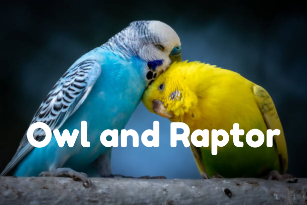
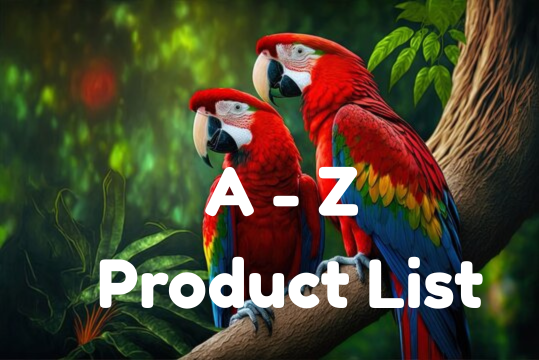
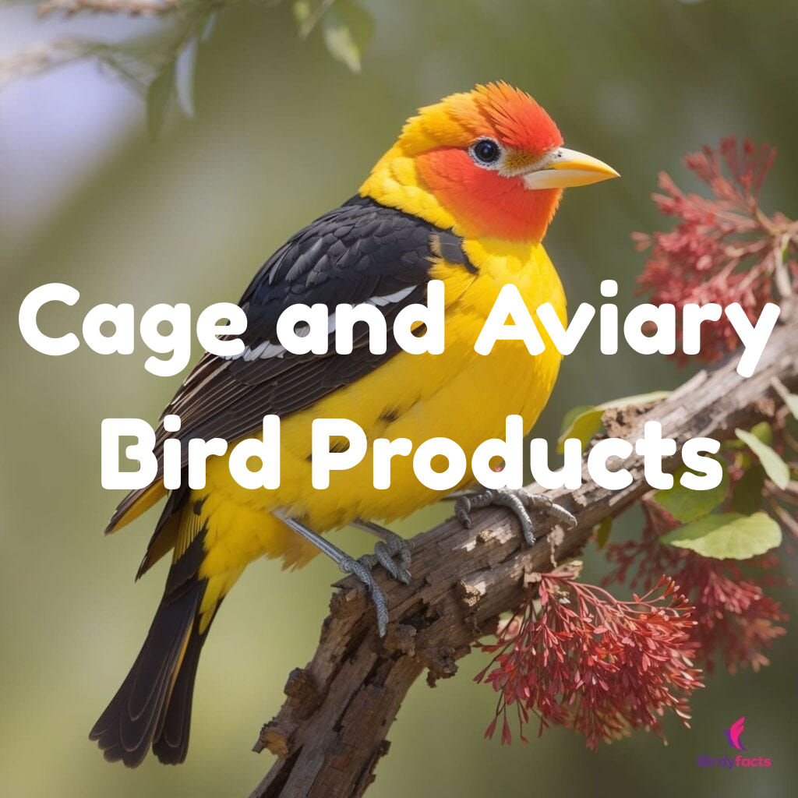
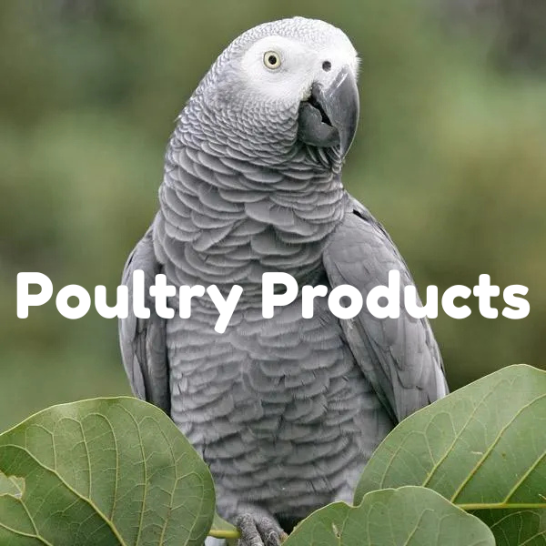

<!DOCTYPE html>
<html lang="en">
<head>
  <meta charset="UTF-8">
  <title>The Birdscare Company</title>
  
</head>

<body>
   <header>
   <nav>
  <a href="website-pages/Christal.html">Home</a>
  
  

    <a href="#">Small Animal Supplements & Hygiene</a>
    

      <a href="a-z-product-list.html" target="_blank">A - Z Product List</a>
      <a href="cage-aviary.html" target="_blank">Cage and Aviary Bird Products</a>
      <a href="poultry-products.html" target="_blank">Poultry Products</a>
    

  

  <a href="website-pages/about.html">About Us</a>
<a href="website-pages/terms-and-conditions.html">Terms & Conditions</a>
<a href="website-pages/contact.html">Contact Us</a>
</nav>

      </header>

  <main>
<section class="hero-section">
  
</section>
     
    <h1>WELCOME TO THE BIRDS CARE COMPANY</h1>
    <h3>World Leading Feeds, Supplements, Health & Hygiene For Birds</h3>

    <section>
      

      
<b><big>The birds care company</big></b> is a passionate, British bird supplements & feed manufacturer using leading edge nutrition to help sick, breeding & pet birds.

      
Founded in 1996, our extensive knowledge and experience has allowed us to develop a broad product range which is used and trusted by top bird keepers around the world.

      
Click on the picture links below to select from products appropriate for the types of birds you keep.
</section>

<section style="text-align: center;">
      

  

      
 

      

      

  
 

  

      

  

    </section>

   <section>
  <h2 style="text-align:center; color:DodgerBlue;">Our Top Products</h2>
  

  

    

      
      
Cage & Aviary Mix

    

    
    

      
      
Poultry Health Formula

    

    

      
      
Pigeon Booster

    

  

</section>

    <section>
      <h2 style="text-align:center; color:DodgerBlue;">Contact Us</h2>
      <form style="max-width:500px; margin:auto;">
        <label>Name:</label> 
        <input type="text"> 

        <label>Email:</label> 
        <input type="email"> 

        <label>Message:</label> 
        <textarea rows="5"></textarea> 

        <button type="submit">Send</button>
      </form>
    </section>
  </main>

  <footer>
    <h2>Stay Connected with The Birdscare Company</h2>
    

      21 Spring Mill Ind Est, 
      Avening Road, 
      Nailsworth, 
      Gloucestershire, 
      GL6 0BS 
      📞 01453 835330
    

    

      <h3>Subscribe to Our Newsletter</h3>
      <form>
        <input type="email" placeholder="Enter your email">
        <button>Subscribe</button>
      </form>
    

    

      © 2025 The Birdscare Company | Follow us:
      <a href="#">Facebook</a> |
      <a href="#">Instagram</a> |
      <a href="#">Twitter</a>
    

  </footer>
</body>
</html>
